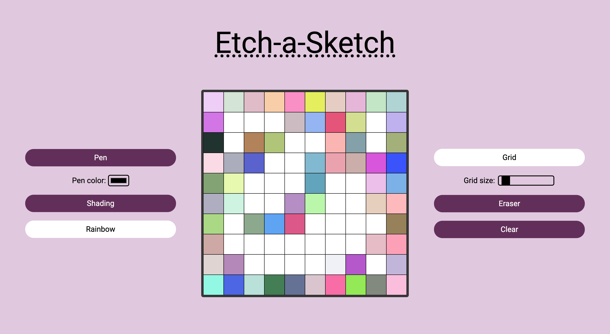

# Etch-a-Sketch

My implementation of the Etch-a-Sketch project for The Odin Project. Try it [here](https://jooo-lee.github.io/etch-a-sketch/)!

## Description:

The user can draw on a canvas in the browser by moving the mouse cursor over the grid. Currently only implemented for the web browser. 

## Features:

* Change pen color
* Apply shading
* Use rainbow pen mode
* Toggle grid
* Change size of grid
* Use eraser
* Clear canvas

## I learned how to:

* Use CSS variables and CSS Grid to make a square grid
* Make div occupy the whole window screen
* Add event listener to change colors of elements when mouse hovers over them 
* Import custom fonts
* Remove all child nodes of a parent node
* Update grid size using event listener
* Split div with children into 3 equally sized sections using CSS Grid
* Use Javascript object to hold pen states
* Parse colors and alpha values from RGBA string using Regex
* Apply :not() CSS pseudo-class to exclude certain elements from being styled
* Add and remove classes from elements dynamically using Javascript